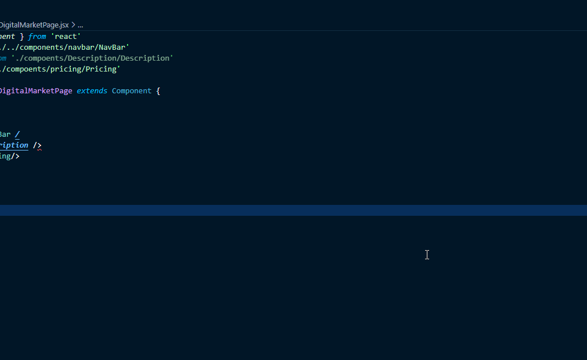

# Change Log

----------

## [0.0.5] - 2021-06-06
### Added

- Integrated with Stackoverflow API 
- Search for Selection in Google <kbd>Ctrl</kbd> + <kbd>Alt</kbd> + <kbd>S</kbd>
- Search for Selection in StackOverflow <kbd>Ctrl</kbd> + <kbd>Alt</kbd> + <kbd>S</kbd>

----------
## [0.0.4] - 2021-06-05
### Added
- Search Any Text in Google Directly <kbd>Ctrl</kbd> + <kbd>Alt</kbd> + <kbd>G</kbd>

    

### Changed
- Changed the category of the extension to Error Help
    - now you can search for all available commands by searching 'Error Help'

----------
## [0.0.3] - 2021-06-05
### Added
- Search on Google functionality
- Search on Github functionality
- Search on Youtube functionality

### Changed
- Formatted the Changelog
- Updated the ReadMe.md

----------
## [0.0.2] - 2021-06-04
### Added
- Initial release
- Search on StackOverflow functionality

<!-- ## [Unreleased] -->