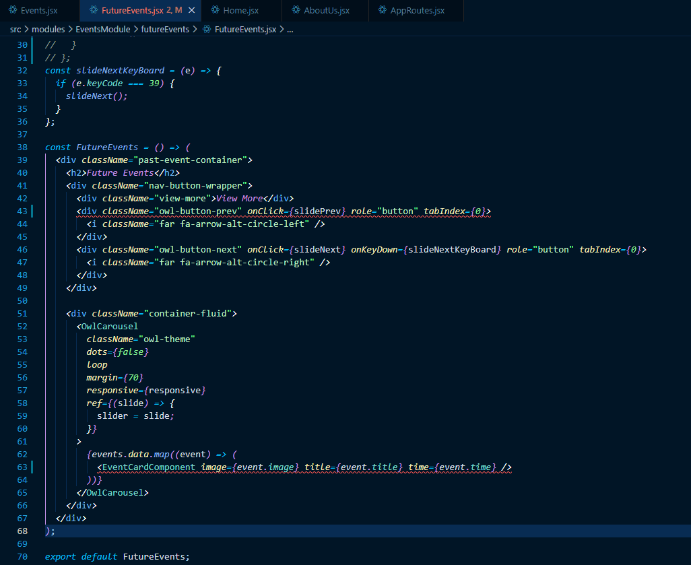

# Error Help

This is a very simple extension developed to help developers in searching help for errors🎆. 

## What can this extension do ?

> Search errors in the code in Google

> Search errors in the code in Stackoverflow

> Search errors in the code in Github

> Search errors in the code in Youtube

> Search a selected text in Google

> Search a selected text in StackOverflow

> Directly navigate to stackoverflow questions based on the search

- 

## How to use this extension ?

### Search Directly on Google
- Press <kbd>Ctrl</kbd> + <kbd>Alt</kbd> + <kbd>G</kbd>, insert the text and press <kbd>Enter</kbd>.
- Press <kbd>Ctrl</kbd> + <kbd>Shift</kbd> + <kbd>P</kbd>, type `>Search Text Google` ,insert the text and press <kbd>Enter</kbd>.
- 

### Search selected text using StackOverflow API
1. Select a portion of text in the editor.
2. Press <kbd>Ctrl</kbd> + <kbd>Alt</kbd> + <kbd>S</kbd>, wait for the result to display.
3. Select any option you like.
- 

### Search errors in the code in Google
- Press <kbd>Ctrl</kbd> + <kbd>Shift</kbd> + <kbd>P</kbd>, type `>Search Google` ,select the error and press <kbd>Enter</kbd>.

### Search errors in the code in Github
- Press <kbd>Ctrl</kbd> + <kbd>Shift</kbd> + <kbd>P</kbd>, type `>Search Github` ,select the error and press <kbd>Enter</kbd>.

### Search errors in the code in Youtube
- Press <kbd>Ctrl</kbd> + <kbd>Shift</kbd> + <kbd>P</kbd>, type `>Search Youtube` ,select the error and press <kbd>Enter</kbd>.

### Search errors in the code in Stackoverflow
- Press <kbd>Ctrl</kbd> + <kbd>Shift</kbd> + <kbd>P</kbd>, type `>Search StackOverflow` ,select the error and press <kbd>Enter</kbd>.

## Future Work
- Capture Exception Stacktrace.

## Contribute to this Extensions and Add your ideas.

- [Github Repository](https://github.com/gihanrcg/error-help)

Add your ideas as issues and code as PRs in the repository and make sure to star the repository 😊

1. Fork the repository
2. Create your feature branch `git checkout -b feature/<your-feature>`
3. Commit and Push your Changes
4. Add a Pull Request. Make sure to add the badge **FEATURE**

